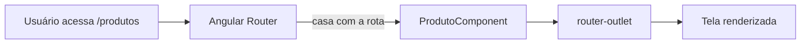
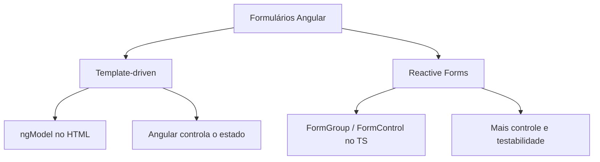
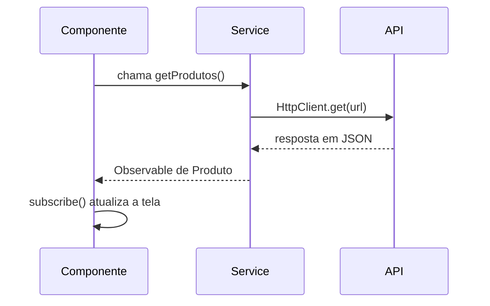

## Roteamento

```mermaid
flowchart LR
    U[Usuário acessa /produtos] --> R[Angular Router]
    R -->|casa com a rota| C[ProdutoComponent]
    C --> O[router-outlet]
    O --> V[Tela renderizada]
```
 
 
 
 
 
 
 
 
 
 
 
 
 
 
 
 

## Formulários: duas abordagens

```mermaid
flowchart TD
    F[Formulários Angular] --> TD1[Template-driven]
    F --> RE[Reactive Forms]
    TD1 --> TD2[ngModel no HTML]
    TD1 --> TD3[Angular controla o estado]
    RE --> RE2[FormGroup / FormControl no TS]
    RE --> RE3[Mais controle e testabilidade]
```
 
 
 
 
 
 
 
 
 
 
 
 
 
 
 
 

## Requisições HTTP

```mermaid
sequenceDiagram
    participant Componente
    participant Service
    participant API

    Componente->>Service: chama getProdutos()
    Service->>API: HttpClient.get(url)
    API-->>Service: resposta em JSON
    Service-->>Componente: Observable de Produto
    Componente->>Componente: subscribe() atualiza a tela
```
