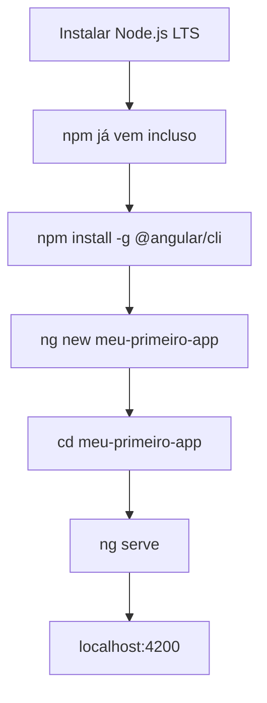
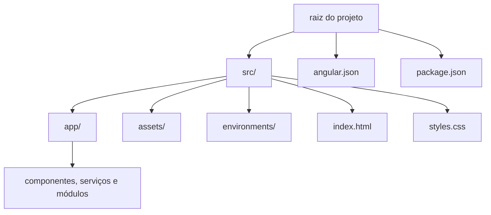

# Diagramas de apoio — Vídeo 5: Instalação, Configuração e Primeiro Projeto

## Do zero ao primeiro projeto rodando

```mermaid
flowchart TD
    A[Instalar Node.js LTS] --> B[npm já vem incluso]
    B --> C[npm install -g @angular/cli]
    C --> D[ng new meu-primeiro-app]
    D --> E[cd meu-primeiro-app]
    E --> F[ng serve]
    F --> G[localhost:4200]
```

## Estrutura básica do projeto

```mermaid
flowchart TD
    ROOT[raiz do projeto] --> SRC[src/]
    ROOT --> ANGJSON[angular.json]
    ROOT --> PKGJSON[package.json]
    SRC --> APP[app/]
    SRC --> ASSETS[assets/]
    SRC --> ENV[environments/]
    SRC --> INDEX[index.html]
    SRC --> STYLES[styles.css]
    APP --> COMP[componentes, serviços e módulos]
```
