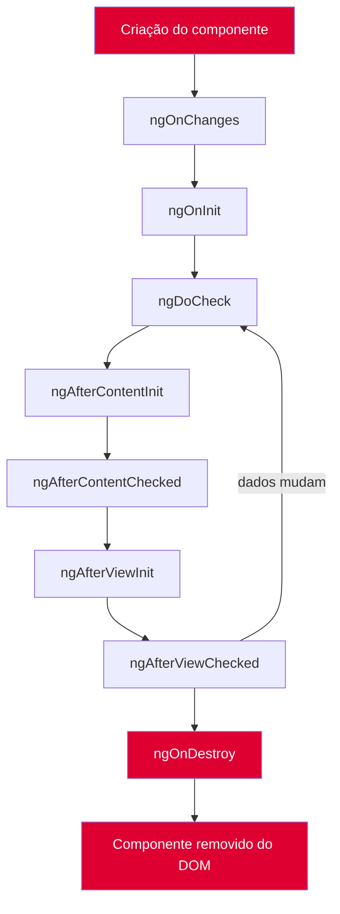
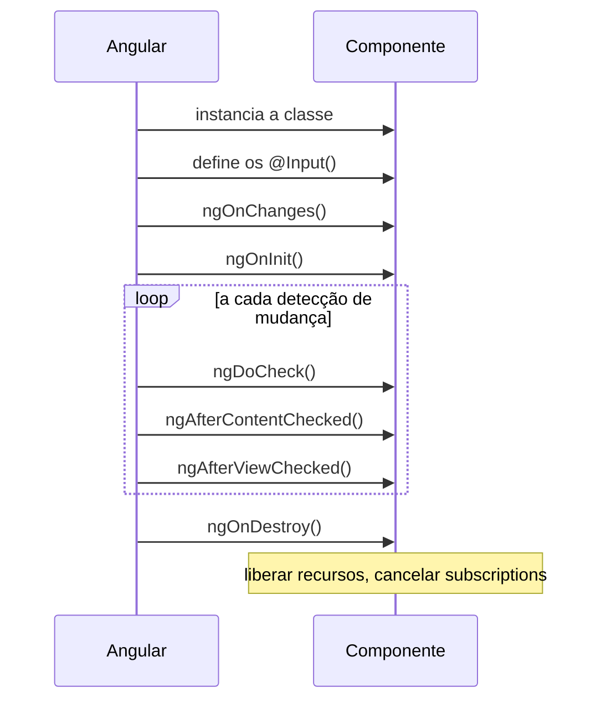

# Diagramas de apoio — Vídeo 1: Introdução e Ciclo de Vida do Componente

## Ciclo de vida de um componente Angular

```mermaid
flowchart TD
    A[Criação do componente] --> B[ngOnChanges]
    B --> C[ngOnInit]
    C --> D[ngDoCheck]
    D --> E[ngAfterContentInit]
    E --> F[ngAfterContentChecked]
    F --> G[ngAfterViewInit]
    G --> H[ngAfterViewChecked]
    H -->|dados mudam| D
    H --> I[ngOnDestroy]
    I --> J[Componente removido do DOM]

    style A fill:#DD0031,color:#fff
    style I fill:#DD0031,color:#fff
    style J fill:#DD0031,color:#fff
```

## Quando cada hook entra em ação

```mermaid
sequenceDiagram
    participant Angular
    participant Componente

    Angular->>Componente: instancia a classe
    Angular->>Componente: define os @Input()
    Angular->>Componente: ngOnChanges()
    Angular->>Componente: ngOnInit()
    loop a cada detecção de mudança
        Angular->>Componente: ngDoCheck()
        Angular->>Componente: ngAfterContentChecked()
        Angular->>Componente: ngAfterViewChecked()
    end
    Angular->>Componente: ngOnDestroy()
    Note over Componente: liberar recursos, cancelar subscriptions
```
