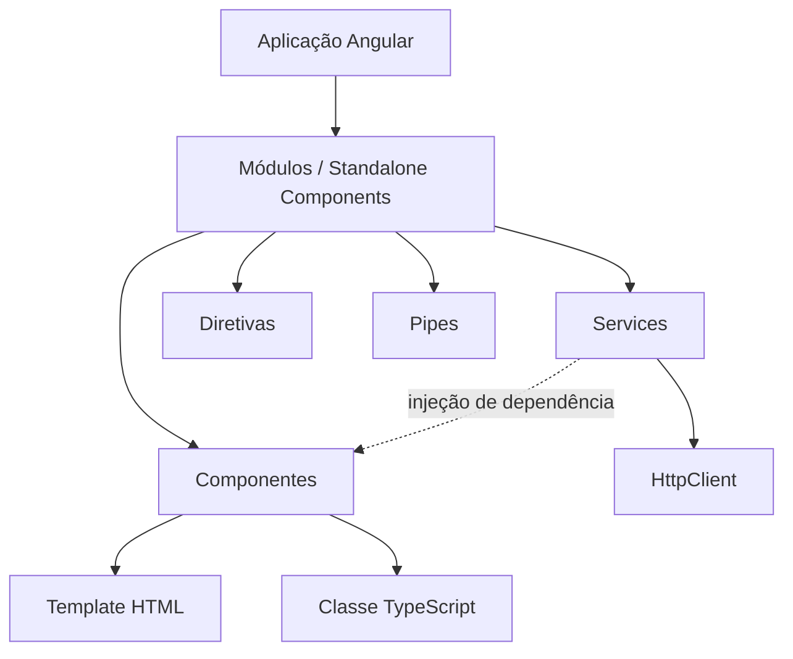
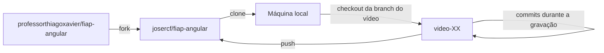

# Diagramas de apoio — Vídeo 4: Por Que Usar o Framework e Repositório Git

## Blocos de construção do Angular

```mermaid
flowchart TD
    APP[Aplicação Angular] --> MOD[Módulos / Standalone Components]
    MOD --> COMP[Componentes]
    MOD --> SERV[Services]
    MOD --> DIR[Diretivas]
    MOD --> PIPE[Pipes]
    COMP --> TPL[Template HTML]
    COMP --> CLS[Classe TypeScript]
    SERV --> HTTP[HttpClient]
    SERV -. injeção de dependência .-> COMP
```

## Fluxo de trabalho com o repositório do capítulo

```mermaid
flowchart LR
    ORIG[professorthiagoxavier/fiap-angular] -->|fork| MEU[josercf/fiap-angular]
    MEU -->|clone| LOCAL[Máquina local]
    LOCAL -->|checkout da branch do vídeo| BR[video-XX]
    BR -->|commits durante a gravação| BR
    BR -->|push| MEU
```
