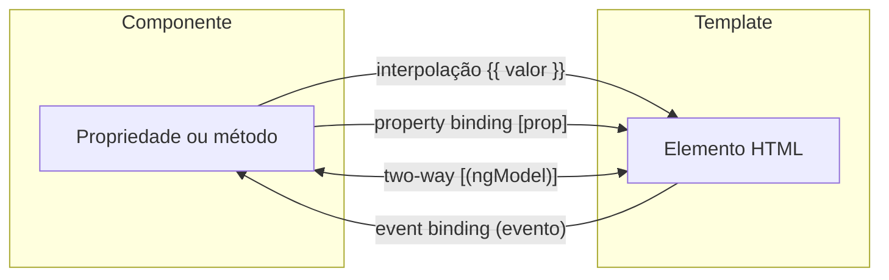
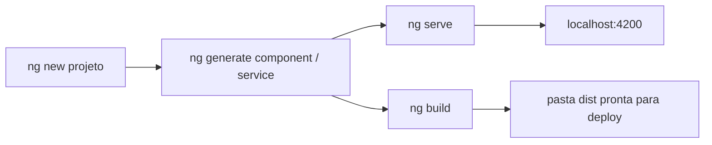

## Os quatro tipos de data binding

```mermaid
flowchart LR
    subgraph Componente
        TS[Propriedade ou método]
    end
    subgraph Template
        HTML[Elemento HTML]
    end

    TS -->|"interpolação {{ valor }}"| HTML
    TS -->|"property binding [prop]"| HTML
    HTML -->|"event binding (evento)"| TS
    TS <-->|"two-way [(ngModel)]"| HTML
```
 
 
 
 
 
 
 
 
 
 
 
 

## Fluxo de comandos do Angular CLI

```mermaid
flowchart LR
    A[ng new projeto] --> B[ng generate component / service]
    B --> C[ng serve]
    C --> D[localhost:4200]
    B --> E[ng build]
    E --> F[pasta dist pronta para deploy]
```

 
 
 
 
 
 
 
 
 
 
 
 
