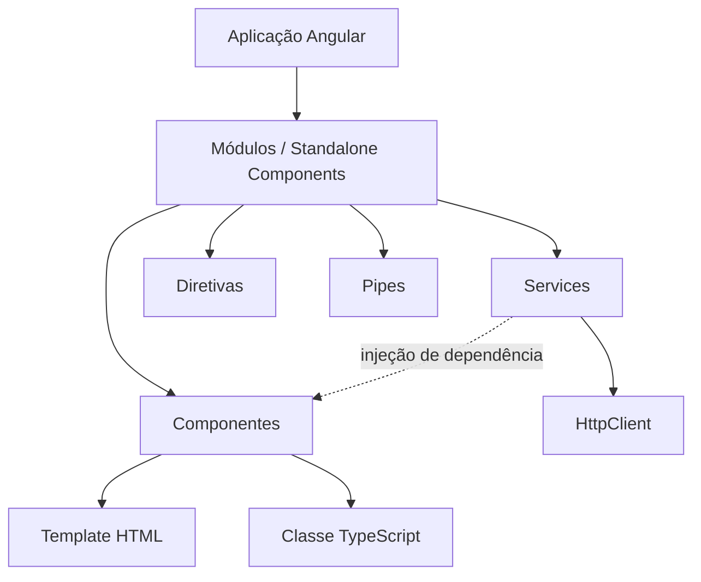

## Blocos de construção do Angular

```mermaid
flowchart TD
    APP[Aplicação Angular] --> MOD[Módulos / Standalone Components]
    MOD --> COMP[Componentes]
    MOD --> SERV[Services]
    MOD --> DIR[Diretivas]
    MOD --> PIPE[Pipes]
    COMP --> TPL[Template HTML]
    COMP --> CLS[Classe TypeScript]
    SERV --> HTTP[HttpClient]
    SERV -. injeção de dependência .-> COMP
```

 
 
 
 
 
 
 
 
 
 
 
 
