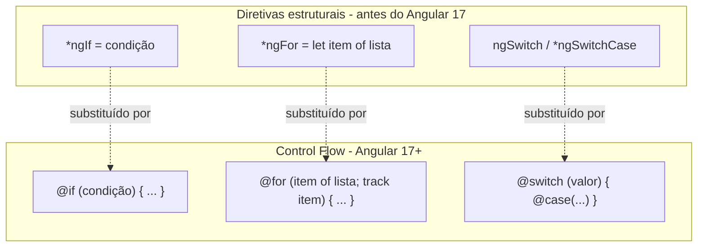
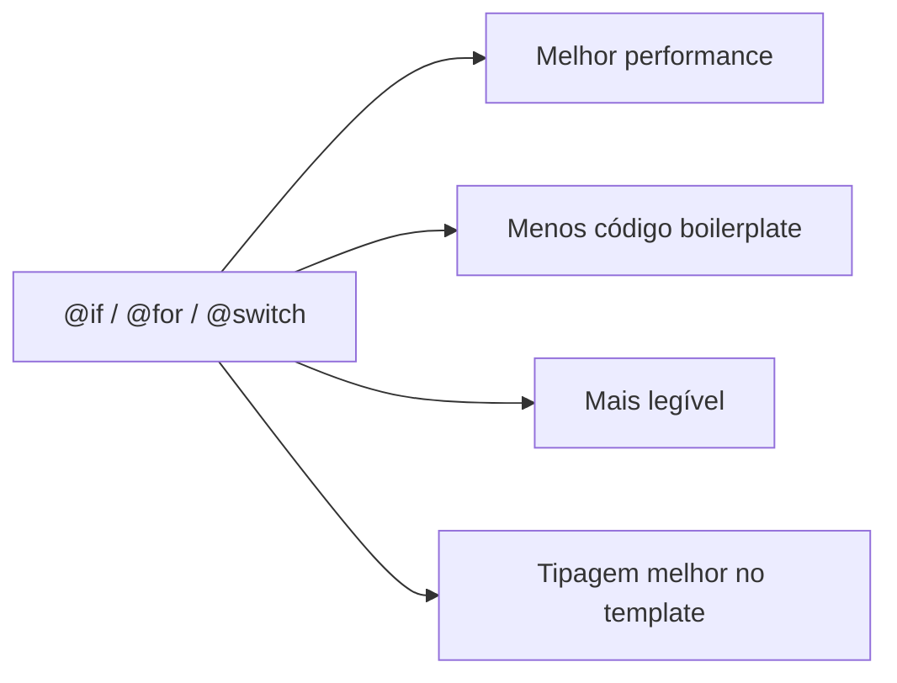

# Diagramas de apoio — Vídeo 8: Control Flow

## Sintaxe antiga x nova

```mermaid
flowchart TD
    subgraph Antiga [Diretivas estruturais - antes do Angular 17]
        NGIF["*ngIf = condição"]
        NGFOR["*ngFor = let item of lista"]
        NGSWITCH["ngSwitch / *ngSwitchCase"]
    end
    subgraph Nova [Control Flow - Angular 17+]
        IF["@if (condição) { ... }"]
        FOR["@for (item of lista; track item) { ... }"]
        SWITCH["@switch (valor) { @case(...) }"]
    end

    NGIF -. substituído por .-> IF
    NGFOR -. substituído por .-> FOR
    NGSWITCH -. substituído por .-> SWITCH
```

## Por que a nova sintaxe

```mermaid
flowchart LR
    A["@if / @for / @switch"] --> B[Melhor performance]
    A --> C[Menos código boilerplate]
    A --> D[Mais legível]
    A --> E[Tipagem melhor no template]
```
